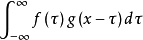
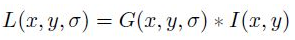
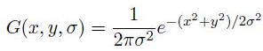

# SIFT特征以及SIFT特征检测（一）

> 因为最近刚好有时间，把之前的项目整理了一下，整合成了P.E.M.P.W.S.项目。考虑到项目的实用性，准备给上面加上目标追踪的功能。在经过一番寻找之后，发现这一方面公开的研究比我想象中的要少许多，所以只能自己从头来。我找到了一篇论文，并且准备尝试复现论文中描述的算法，作为一个入门。这一系列博客，也方便我整理这一段时间的所学。博客将不定时更新，跟进我的学习进度。因为是第一次做图像追踪和机器视觉方面的内容，若有错误，还望指正。

## 什么是卷积

首先，在进入SIFT的学习之前需要了解的一个东西就是什么是卷积。这个名词在各种听起来很高大上的东西里都出现过，像什么卷积神经网络，卷积放大，等等。那什么是卷积呢？首先，卷积跟卷没有关系，是一种数学算子。设有两个函数f(x)和g(x)，它们在定义域上可积。那么作积分

 
可以想到，这个积分存在（本文不讨论数学，~~因为我数学太烂了，~~所以各种证明就不再证了，有兴趣的话可以自己研究看看）。这个积分将得到一个新的函数h(x)，这个函数就是它们的卷积，表示为f(x)=(h*g)(x)。所以，卷积是一种积分，最后获得的还是一个关于x的函数。

对于离散的序列（比如这次研究的图像像素），卷积可以看成两个变量在某一范围内相乘求和。在图像研究中，通常的卷积操作是这样的：在图像上移动一个n阶的正方形，称做卷积窗格或卷积模板，模板在图像上扫过，对模版内的数据执行一定的运算，获得每个中心点的卷积结果。

## 什么是SIFT特征

SIFT特征是一种局部特征，通俗的理解就是，图片具有的某种属性在某一个独特的点的体现。这个点不是图像模式识别中所说的特征点，二十一种更抽象的点，和这个点处的图像关系不大，而和周围乃至全局的图像点有关。

## 怎么求SIFT特征

### 构建高斯尺度空间

将高斯尺度空间用一个函数表示，则它是尺度可变高斯函数和原图的卷积。也就是说，对于高斯尺度空间L(x,y,σ)，有

 
其中，I(x,y)是指原图。

**这里说明一下：什么叫用函数表示原图呢？这里引用一位大佬给我讲的内容：图上的每一个像素点，都有一些自身属性，比如灰度图，I的范围就是0~255，RGB同理，有各种分量。在进行卷积的时候，对每一个channel分开卷积，再合并到新的像素点。作为最终卷积结果。**

公式中的G(x,y,σ)是尺度可变高斯函数，它的表达式是

 
其中，(x,y)是空间坐标，也是尺度坐标。σ大小决定图像的平滑程度，大尺度对应图像的概貌特征，粗糙尺度(低分辨率)，反之，小尺度对应图像的细节特征，精细尺度(高分辨率)。

至此，进行SIFT运算的第一步（构建差分高斯尺度空间）的第一步（初始化高斯尺度空间）就完成了，之后的内容在接下来的博文中继续讨论。
